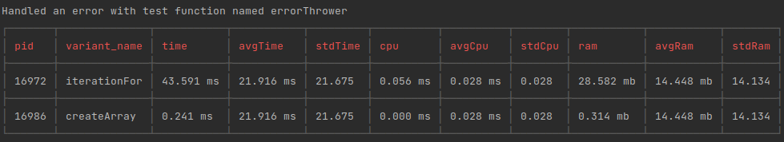

# JavaScript Performance Benchmark Tool

A lightweight, command-line performance benchmarking utility for JavaScript functions with statistical analysis and configurable test parameters.

## 🚀 Quick Start

```bash
npm install benchmark-javlonbek
```

```bash
mybench p=path/to/test.js i=10000 r=3
```

## 📊 Usage

### Command Line Interface
```bash
mybench p=<path> i=<iterations> r=<runs>
```

**Parameters:**
- `p` (path): Path to the JavaScript file containing functions to benchmark
- `i` (iterations): Number of iterations per test run (default: 10000)
- `r` (runs): Number of test runs for statistical accuracy (default: 3)

### Test File Format

Your test file should export functions using CommonJS format:

```javascript
function iterationFor() {
    for (let i = 0; i <= 100; i++) {
        const obj = Object.create({ name: 'Tom' });
    }
}

function createArray() {
    const newArray = new Array(20);
}

module.exports = {
    iterationFor,
    createArray
};
```

## 📈 Output

The tool provides comprehensive performance metrics including:
- Execution time per iteration
- Statistical analysis across multiple runs
- Performance comparison between functions



## 🔧 Features

- **Statistical Accuracy**: Multiple test runs for reliable results
- **Configurable Parameters**: Adjust iterations and runs based on your needs
- **Easy Integration**: Simple CLI interface for quick performance testing
- **Lightweight**: Minimal dependencies for fast installation

## 💡 Use Cases

- Performance optimization of JavaScript algorithms
- A/B testing different implementation approaches
- Continuous performance monitoring in development workflow
- Educational tool for understanding JavaScript performance characteristics

## 🤝 Contributing

Contributions are welcome! Please feel free to submit issues and enhancement requests.

## 📄 License

MIT License - see LICENSE file for details.
